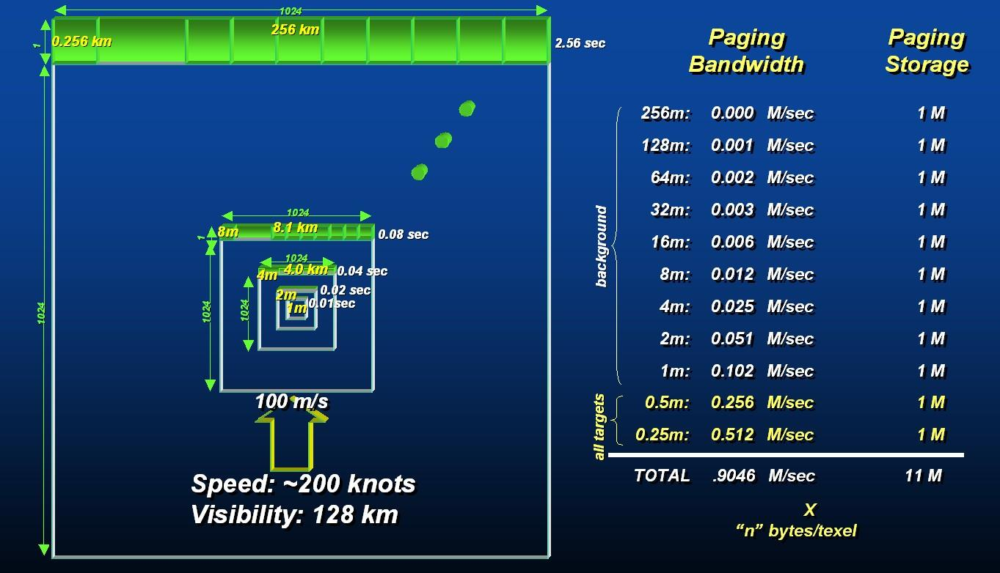
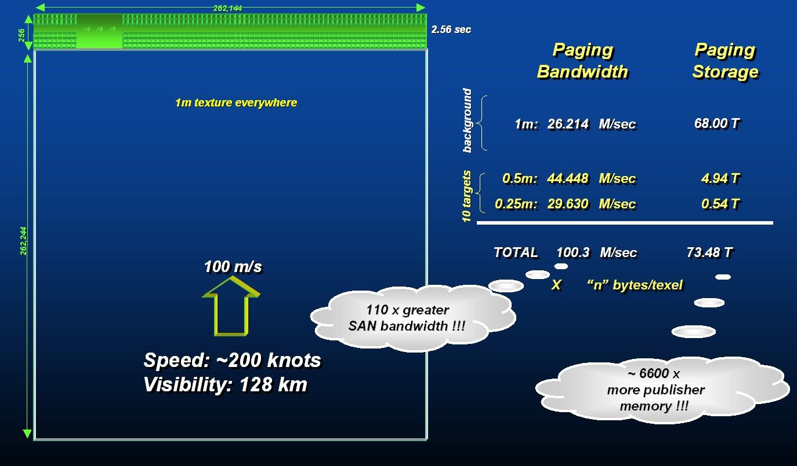

[Appendix]
= Annex G: Rationale: Importance of Level of Detail

*Formerly Appendix A-12 of Volume 2 of the OGC CDB Best Practice.*

The availability of LODs for most datasets is critical for real-time
performance. Many simulator client-devices can readily take advantage of
an LOD structure because many clients naturally require less detail with
increasing distance away from the simulated own ship position. For
example, the projection of screen pixels (i.e. pixels in an IG image
plane) onto near-field terrain subtends much less area than the
projection of screen pixel onto far-field terrain near the horizon; as a
result, much less detail is required at far range. In addition, clients
may need to revert to an alternate coarser representation if they cannot
cope with the paging bandwidths, memory footprint or computational
requirements of finer LODs. This provides a solid basis on which
client-devices can build paging managers, load management and memory
management algorithms.

The following example illustrates the important performance
considerations and the inherent performance advantage that can be
achieved with an LOD structure. Consider a simulator client-device, with
a capability to display terrain imagery out to 128 km; the imagery is 1m
at its finest available resolution and the simulated ownship is flying
at 100 m/s. Under these conditions, and without the benefit of an LOD
organization (as illustrated in <<img_PagingOfTerrainImageryWithoutAnLODStructure>>: Paging of Terrain Imagery
without an LOD Structure), the client-device would require access to the
imagery at a rate of ~100 Mpixels/sec. Consider on the other hand the
same operating conditions but with the client-device accessing
LOD-organized imagery (as illustrated in <<img_PagingOfTerrainImageryWithAnLODStructure>>: Paging of Terrain
Imagery with an LOD Structure). Furthermore, assume that the
client-device only requires 1m imagery for ranges less than 1/2 km, 2m
for ranges less than 1km, 4m for ranges less than 2km, and so on. With
the benefit of an LOD structure, the client-device would require access
to the imagery at a much lower rate of ~1 Mpixels/sec, reducing access
bandwidth by a factor of ~100x over the non-LOD approach. Clearly, such
performance gains cannot be ignored for real-time applications such as
flight simulators, especially when one realizes that access bandwidth
increases as the square of the imagery resolution.

In addition to a reduction in access bandwidth, the LOD structure also
benefits simulator client-devices that have a requirement to dynamically
filter the data to control aliasing. In effect, part of the
client-device filtering process is relegated to an off-line process.

The CDB standard does not enforce, nor does it specify the type of
filter used to compute the data element values of raster-organized or
list-organized datasets. Yet, it is clear that inadequate off-line
filter may affect the rendering quality of the affected client-devices.
As a result, the CDB standard provides guidelines to govern the quality
of the off-line LOD process; these guidelines are provided with each of
the raster-organized dataset (or list-organized datasets in future
releases of the CDB standard).

[#img_PagingOfTerrainImageryWithAnLODStructure,reftext='Figure A-14']
*Figure A-14: Paging of Terrain Imagery with an LOD Structure*

[#img_PagingOfTerrainImageryWithoutAnLODStructure,reftext='Figure A-15']
*Figure A-15: Paging of Terrain Imagery without an LOD Structure*

